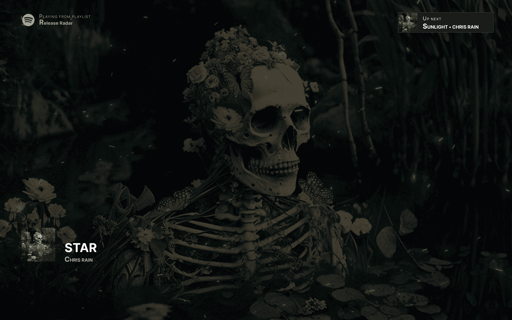
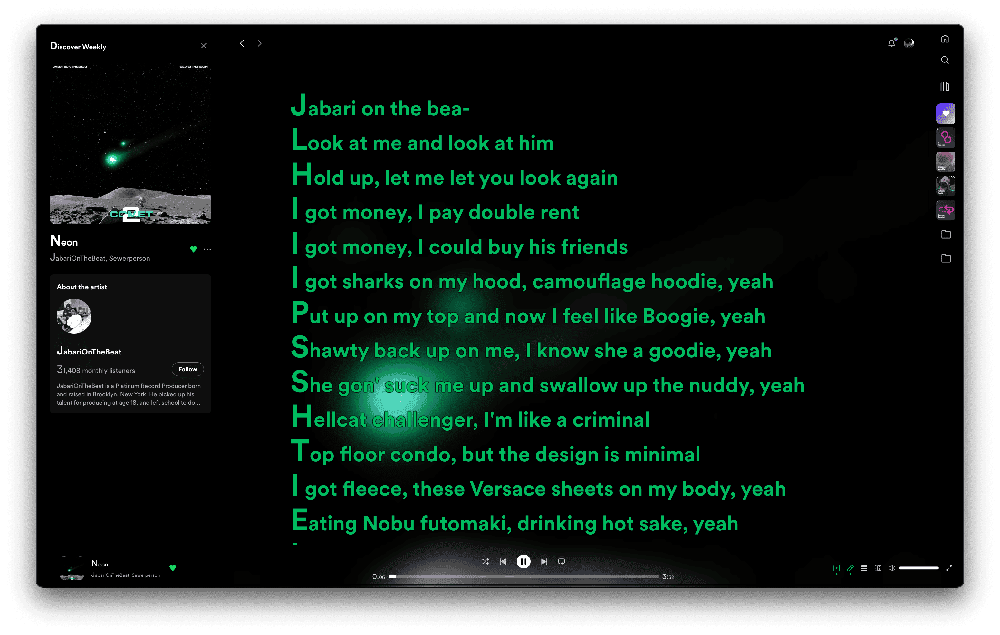
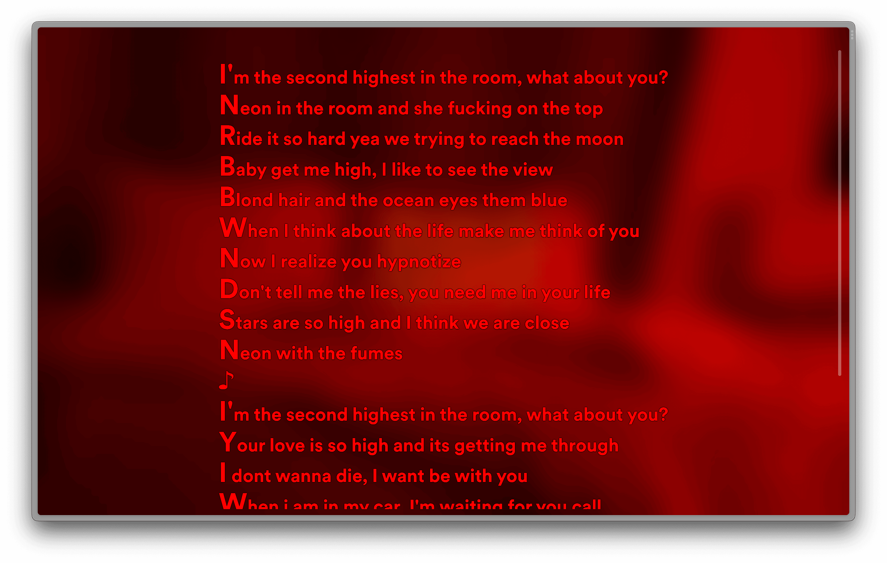
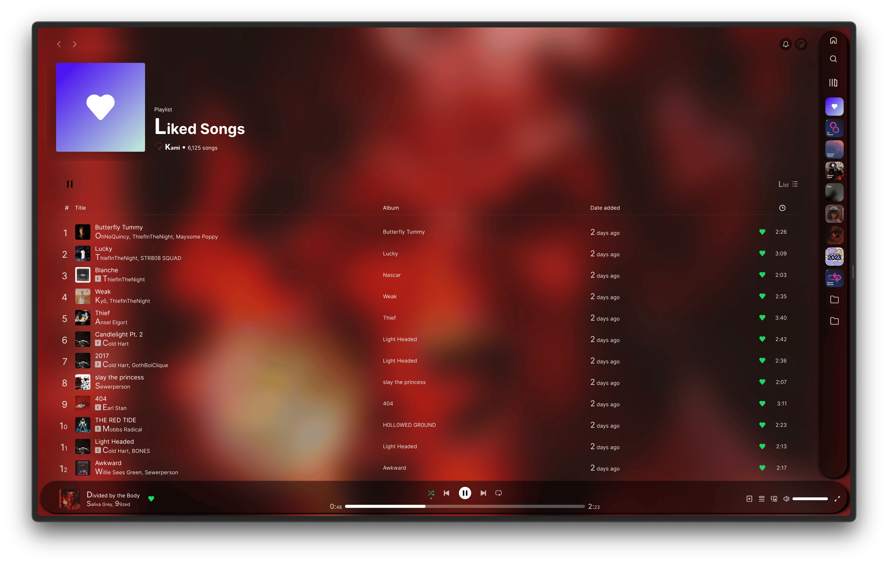
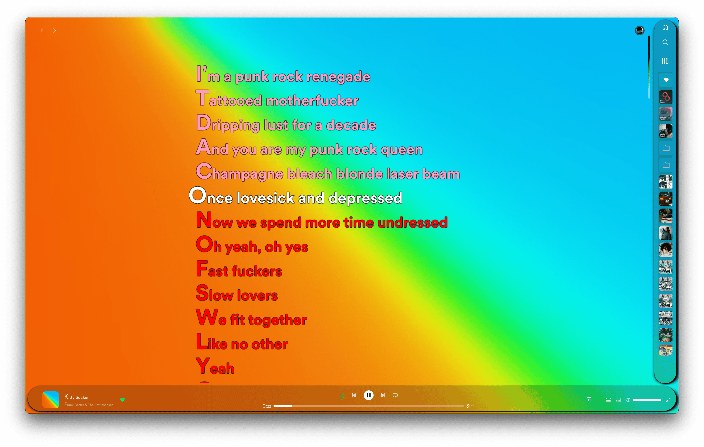
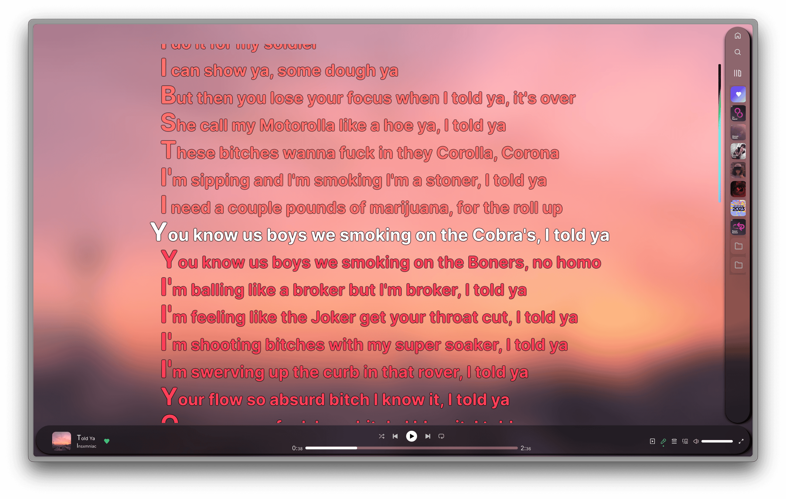
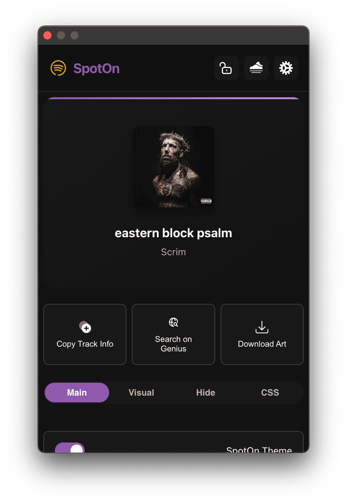
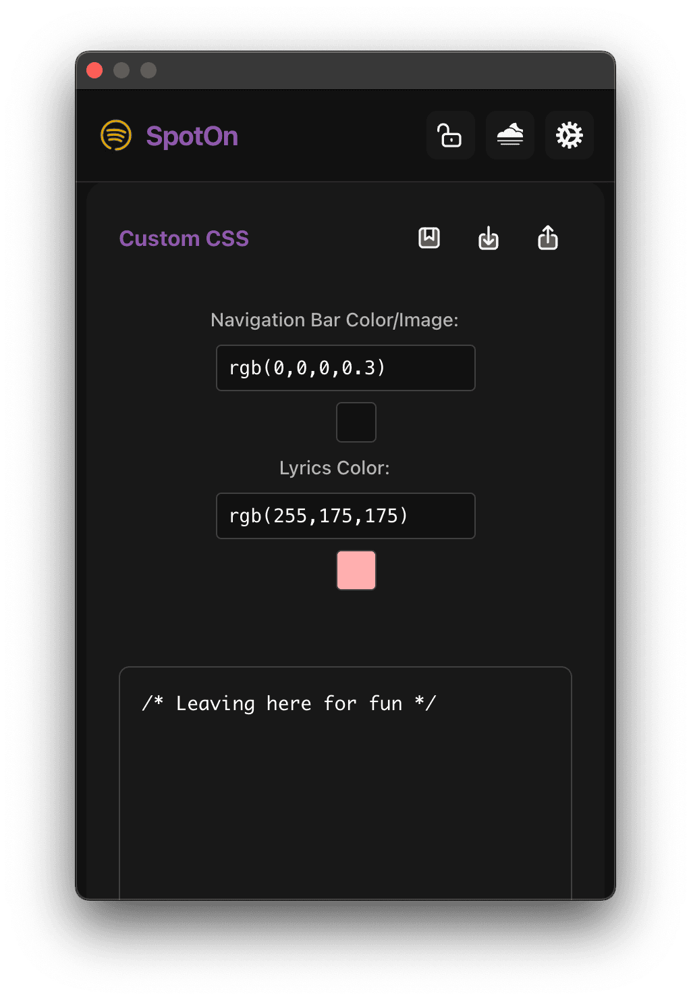
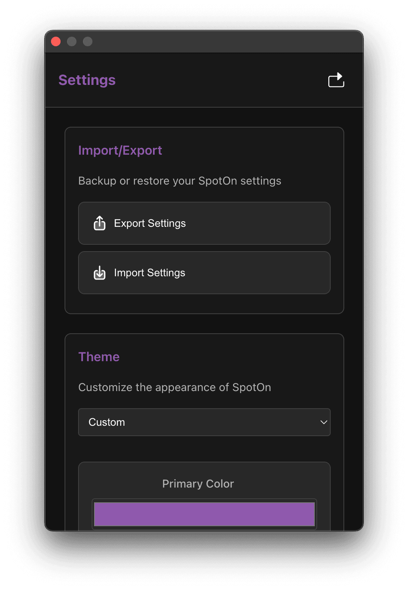

# SpotOn

Enhance your Spotify Web Player experience with SpotOn. A complete UX/UI overhaul!

---

# DEPRECATED

As of **5 January 2026**, SpotOn is officially deprecated and will no longer be updated or maintained. In addition, the SpotOn extension has been removed from the web store from today onwards and is no longer available for new installs.

Over the years, I have been the sole developer of SpotOn. During that time, the extension reached around 401 users. While I’m grateful for everyone who tried and used it, growth remained limited, and the project never quite reached the momentum needed to justify ongoing maintenance.

SpotOn began as a personal project, where I fixed issues when I could reproduce them in my own setup. However, recent changes to the Spotify web player have introduced frequent breaking updates, making it increasingly time‑consuming to keep everything working. Combined with slower feature releases from Spotify and a generally declining web experience, the effort required to maintain the extension stopped being sustainable for a one‑person project.

---

## Stats

Now for some fun SpotOn stats!

- Total options count: 61 toggles + additional custom settings.
- SpotOn load times: 0.3 ms (lowest 0.1 ms/0.6 ms).
- Totalized SpotOn extension size: 193 KB.
- First screenshot(s): October 2, 2022.
- Original userscript size: 800 KB (single use).
- First extension release date: May 14, 2023.
- Initial extension size: 574 KB.

<h6 align="center">
 
    
    
    
    
    
    
    
    
    
</h6>

 

---

## SpotOn Pics

### How does SpotOn Look?

|  |  |  |
| ------------------------------------- | ------------------------------------- | ------------------------------------- |
|  |  |   |

### Settings

| Settings main view                      | CSS section / Sidebar & Lyrics Coloring | Settings (top right cog)                |
| --------------------------------------- | --------------------------------------- | --------------------------------------- |
|  |  |  |

---

## Features

**TL;DR:** SpotOn enhances your Spotify experience with 61 customizable toggles, allowing for a personalized UI including full custom CSS support, simple color changes without coding, and import/export functionality. Or enjoy your album art being your background!

 

d. Hotkeys
SpotOn comes with full customisable hotkeys, Play/Pause and Skip/Reverse with your Media Keys! All changeable at `chrome://extensions/shortcuts`

| Name                   | Hotkey               | Defaults |
| ---------------------- | -------------------- | -------- |
| Activate the extension | N/A                  | N/A      |
| Like/Dislike           | ⌘⇧B                  | N/A      |
| Next Track             | Media Next Track     | Yes      |
| Play/Pause             | Media Play/Pause     | Yes      |
| Previous Track         | Media Previous Track | Yes      |
| Toggle Repeat          | ⌥R                   | N/A      |
| Seek Backward          | N/A                  | N/A      |
| Seek Forward           | N/A                  | N/A      |
| Toggle Shuffle         | ⌥S                   | N/A      |
| Volume Down            | N/A                  | N/A      |
| Toggle Mute            | N/A                  | N/A      |
| Volume Up              | N/A                  | N/A      |

What I mean by "hotkey" are suggested and used hotkeys (those used by me). The only three set by default and cannot be reset (if changed) are the media keys, which can be made global (works outside of the browser) or only inside the browser.

For more information on how to create a custom hotkey, it's pretty simple: click the hotkey box, then on your keyboard, press the combination you want. Let go, and voilà! If there are no conflicts, you'll see that your keybind is ready to use! The keen-eyed among you might have noticed that the list includes macOS keybinds. However, this doesn't matter as Chrome will detect your system and adjust accordingly. (This repository won't; I use a Mac, so there will be Mac keybinds :0)

---

### Install from Source

1. **Clone the Source Repository:**
   - Clone via terminal: `git clone https://github.com/Nabeel-Farooq/SpotOn`
   - Alternatively, download the source as a ZIP file from the repository.

2. **Set Up the Extension in Chrome:**
   - Access `chrome://extensions` in your browser.
   - Enable developer mode (top right toggle).
   - Select "Load Unpacked" and navigate to the `SpotOn/SpotOn` folder.
   - Confirm by pressing `enter` or `return` on your keyboard, and customize SpotOn settings as required.

